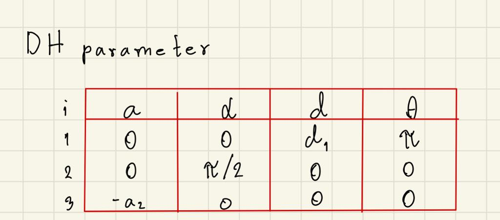
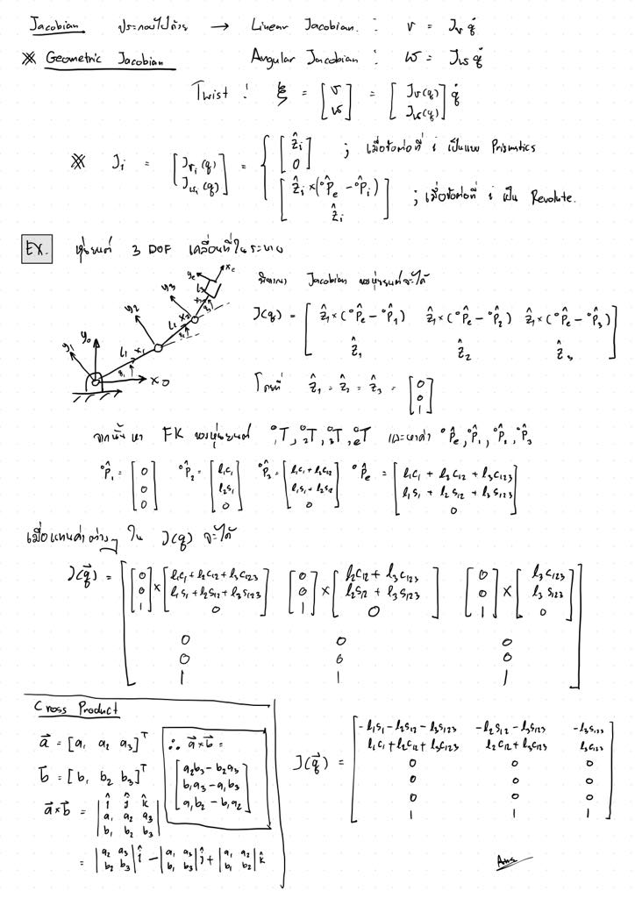
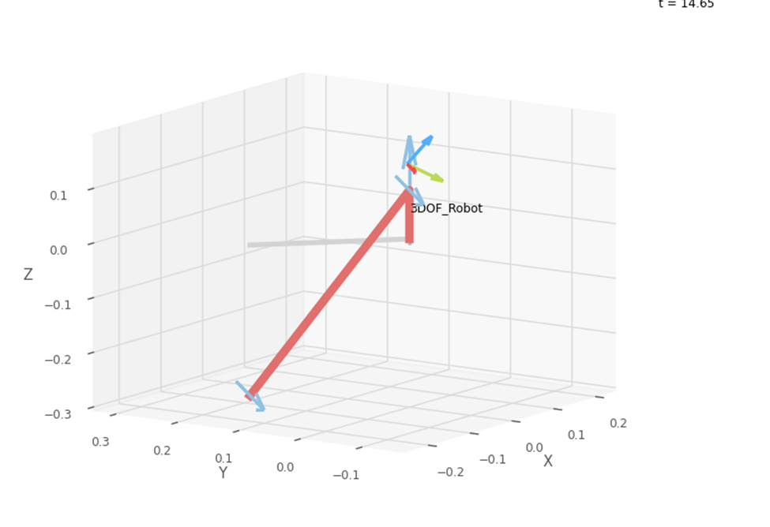
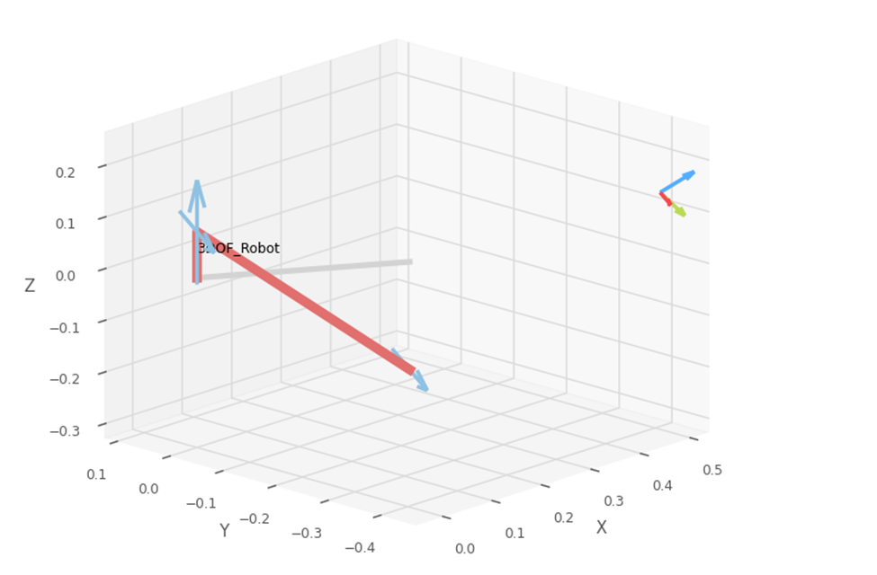
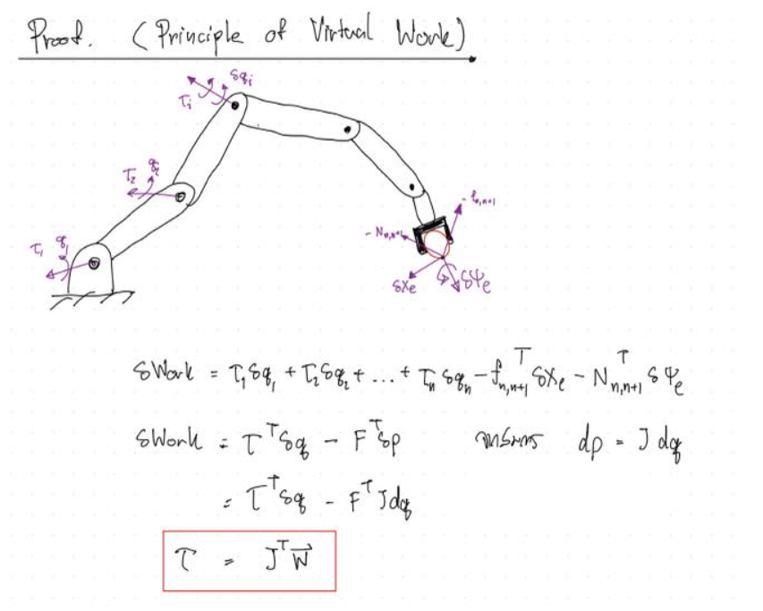

# FRA333_HW3_6508_6524
 
**เริ่มต้น**

สร้าง DH parameter สำหรับการเรียกใช้ในขั้นถัด ๆ ไป


วิธีการและสูตรที่ใช้อ้างอิง


**ข้อที่ 1**

สร้าง function หา jacobian matrix แล้วนำค่าที่ได้ไปเทียบกับค่าจาก robotics toolbox

ฟังก์ชั่นที่สร้าง
```python
def endEffectorJacobianHW3(q:list[float])->list[float]:
    R,P,R_e,p_e = FKHW3(q)
    Jacobian_matrix = np.zeros([6, 3]) #สร้างเมทริก 6*3 โดยทุกตัวมีค่า 0
    for i in range(3):#สั่งวนลูป 3 ครั้งเพราะมี 3 joint
        p_i = P[:,i]#ดึงค่า P ทุกแถวในคอลั่มน์ i
        Z_i = R[:,2,i]#ดึงค่า R ทุกแถวในคอลั่มน์ 3 ของชุดที่ i
        linear_jacobian = np.cross(Z_i, p_e - p_i)#ใช้สูตร Zi cross (Pe - Pi) ให้ได้ linear jacobian velocity
        Jacobian_matrix[:3, i] = R_e.transpose() @ linear_jacobian #ใส่ linear_jacobian เข้าไปใน 3 แถวบนของjacobian matrix และแปลงเฟรมให้เข้าเฟรมe
        Jacobian_matrix[3:, i] = R_e.transpose() @ Z_i#ใส่ Z_i เข้าไปใน 3 แถวล่างของjacobian matrix และแปลงเฟรมให้เข้าเฟรมe
    return Jacobian_matrix #ส่งค่า Jacobian_matrix กลับ
```

ตัวอย่างผลลัพธ์เมื่อ q = [pi,pi,pi]
```
My jacobian
[[ 4.94300000e-02  2.66789440e-18 -2.33558512e-17]
 [ 1.39695452e-17 -4.94300000e-02 -4.74430000e-01]
 [-1.09000000e-01 -9.30000000e-02 -9.30000000e-02]
 [ 1.22464685e-16  1.00000000e+00  1.00000000e+00]
 [ 1.00000000e+00 -6.12323426e-17 -6.12323426e-17]
 [ 1.83697015e-16  6.12323559e-17  6.12323559e-17]]
```
```
Toolbox jacobian
[[ 4.94300000e-02  0.00000000e+00  0.00000000e+00]
 [ 2.36705857e-17 -4.94300000e-02 -4.74430000e-01]
 [-1.09000000e-01 -9.30000000e-02 -9.30000000e-02]
 [ 6.12323400e-17  1.00000000e+00  1.00000000e+00]
 [ 1.00000000e+00  0.00000000e+00  0.00000000e+00]
 [ 2.44929360e-16  0.00000000e+00  0.00000000e+00]]
```
 **สรุป** ค่าที่ได้ต่างกันเพียงหลักทศนิยมที่มีค่าเล็ก ๆ จึงสรุปได้ว่าทำถูกต้อง

**ข้อที่ 2**
สุ่มค่า   q ขึ้นมาแล้ว ใช้วิธีเรียกฟังก์ชั่นที่เราสร้างเองเทียบกับการ
เรียกใช้ผ่าน robotics toolbox โดยนำค่า flag มาเปรียบเทียบกันว่าเป็น 0 หรือ 1 ตรงกันหรือไม่

ฟังก์ชั่นที่สร้าง
```python
def checkSingularityHW3(q:list[float])->bool:
    E = 0.001 #กำหนดค่า E ตามโจทย์
    Jacobian_matrix = endEffectorJacobianHW3(q) #เรียกใช้ฟังก์ชั่นหา jacobian ที่เราสร้างไว้
    det = np.linalg.det(Jacobian_matrix[:3,:]) #หา det ของ Jacobian matrix ที่ลดรูปแล้วเหลือแค่ linear jacobian
    det_norm = np.linalg.norm(det)#หา norm ของ Jacobian matrix
    if det_norm < E: # หาก det_norm ที่ได้น้อยกว่า E 
        return 1 #ส่งค่า 1 กลับคือใกล้ติด Singularity
    else: #หากค่าที่ได้ไม่น้อยกว่า E 
        return 0 #ส่งค่า 0 กลับคือไม่ติด Singularity
```

ตัวอย่างผลลัพธ์
```
test case q is [1.8971462340628367, 1.0755906460649824, 0.3359824623362006]
my function flag is      0
robotics toolbox flag is 0

test case q is [1.6687073837614688, 1.7071578516081576, 0.16771436511536042]
my function flag is      0
robotics toolbox flag is 0

test case q is [2.7584588611037546, 2.661917281052559, 2.9323261483372534]
my function flag is      1
robotics toolbox flag is 1
```
ตัวอย่างท่าทางของหุ่นยนต์ที่ใกล้ singularity (flag = 1)


ตัวอย่างท่าทางของหุ่นยนต์ที่ห่าง sigularity(flag = 0)


**สรุปเพื่อสร้างฟังก์ชั่น**
จากการสุ่มเทสเคส q ต่าง ๆ มา จะเห็นได้ว่าฟังชั่นที่เราสร้างเองส่งค่ากลับ 1 หรือ 0 ค่าที่ได้จากการเรียกใช้ผ่าน robotics toolbox ก็จะได้ค่าเดียวกันเสมอ ซึ่งหมายความว่าเราสร้างฟังชั่นถูกต้อง

**ข้อที่ 3**

**สูตรที่ใช้เพื่อสร้างฟังก์ชั่น**


```python
def computeEffortHW3(q:list[float], w:list[float])->list[float]:
    Jacobian_matrix = endEffectorJacobianHW3(q)#เรียกใช้ฟังก์ขั่นสร้าง Jacobian matrix
    Jacobian_matrix_transposed = np.array(Jacobian_matrix).transpose()#หา Jacobian matrix transpose
    Tua = Jacobian_matrix_transposed @ w#ใช้สูตร Jacobian matrix transpose dot wrench
    return -Tua#ส่งกลับค่า Tua เป็นลบเพราะเป็นแรงปฏิกิริยา
```

ตัวอย่างผลลัพธ์
```
my Tua      [4.33223334 3.10868283 3.49758005]
toolbox Tua [4.33223326 3.10868276 3.49758   ]

my Tua      [0.4705816  4.80901775 5.67430007]
toolbox Tua [0.47058156 4.80901766 5.6743    ]

my Tua      [-0.77759006  6.28463221  5.01386991]
toolbox Tua [-0.77759005  6.28463237  5.01387   ]

my Tua      [2.93196289 4.99934195 3.49758008]
toolbox Tua [2.93196294 4.99934179 3.49758   ]

my Tua      [1.39581179 1.82400541 3.78600979]
toolbox Tua [1.39581188 1.82400553 3.78601   ]
```
**สรุป**
ค่าที่ได้จากการเรียกใช้ฟังก์ชั่นที่ตัวเองสร้างแตกต่างจากที่ได้จาก robotics toolbox ในทศนิยมตำแหน่งท้าย ๆ เท่านั้นซึ่งหมายความว่าคำตอบของเราถูกต้อง